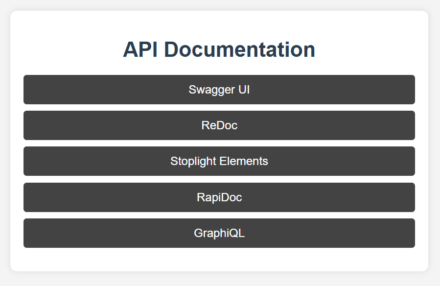
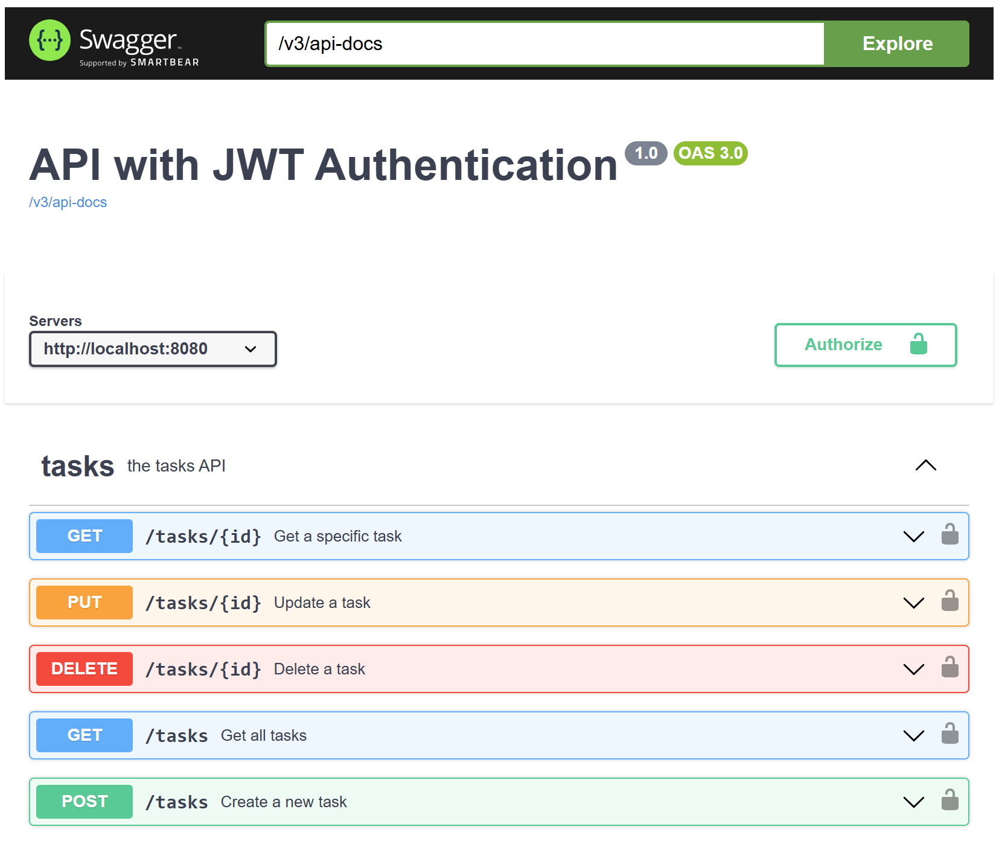
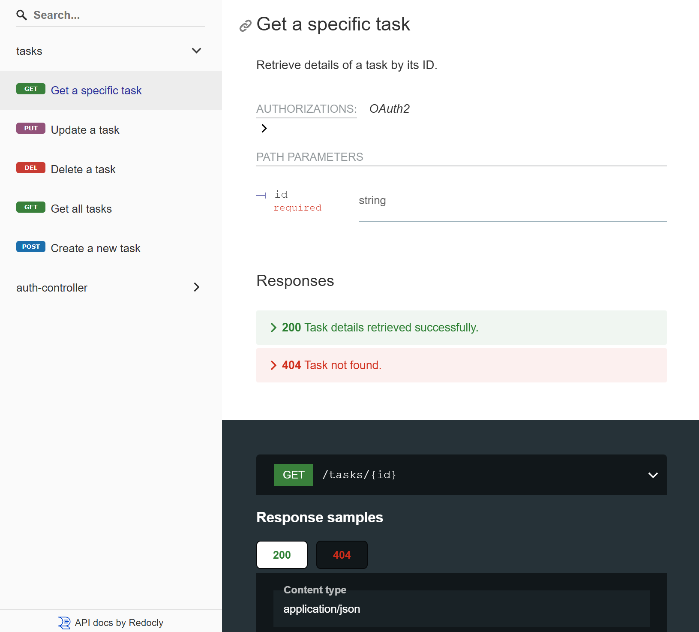
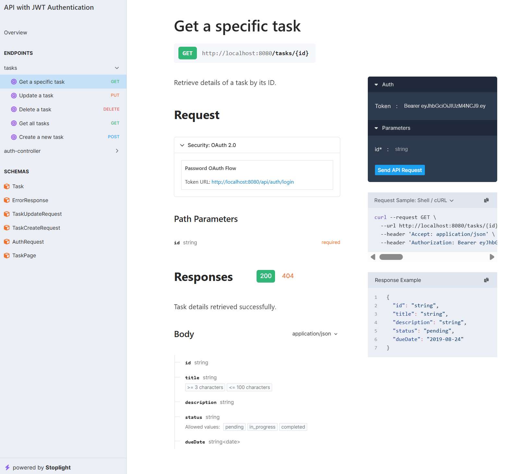
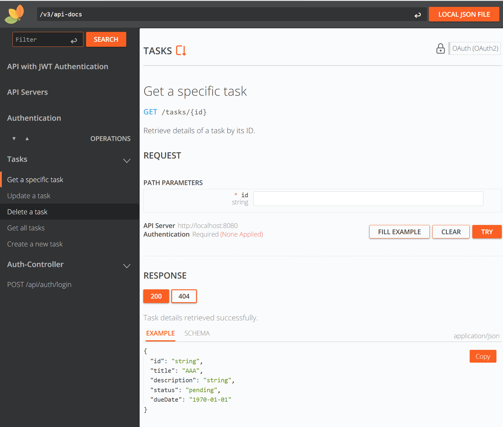
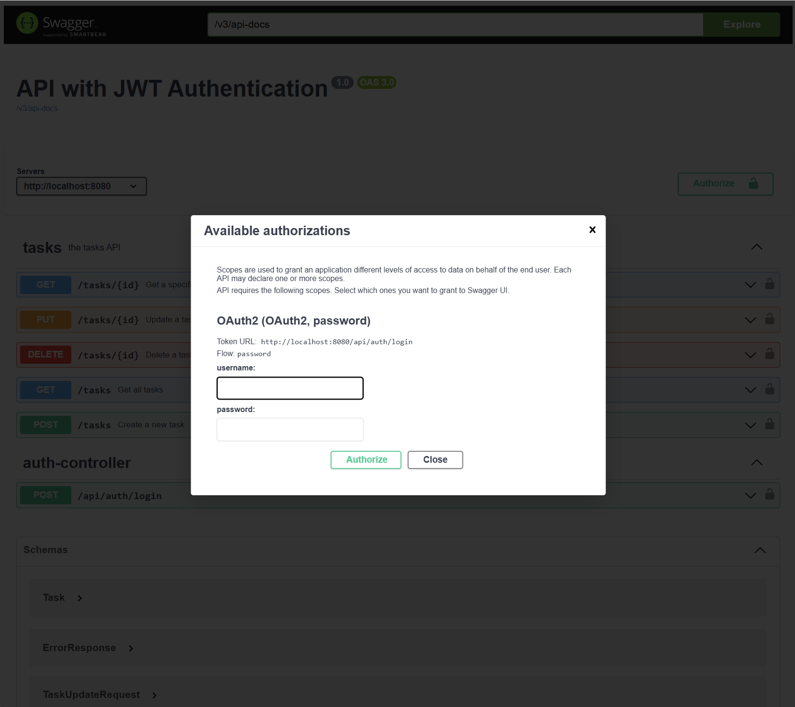

# Task API Demo

🚀 **Task API Demo** – A fully featured **Task Management API** built with **Spring Boot**, supporting **both REST and GraphQL**.

# **Table of Contents**
1. [Task API Demo](#task-api-demo)
2. [🔹 Features](#-features)
3. [🏗️ How It Was Built](#-how-it-was-built)
   - [REST API](#rest-api)
     - [1️⃣ Define OpenAPI Specification](#1️⃣-define-openapi-specification)
     - [2️⃣ Auto-Generate Code Using OpenAPI Generator](#2️⃣-auto-generate-code-using-openapi-generator)
     - [3️⃣ Implement Business Logic & Services](#3️⃣-implement-business-logic--services)
   - [GraphQL API](#graphql-api)
     - [4️⃣ Add GraphQL Support](#4️⃣-add-graphql-support)
4. [🔄 Auto-Generated vs. Manual Implementation](#-auto-generated-vs-manual-implementation)
5. [🛠️ Installation & Setup](#-installation--setup)
   - [1️⃣ Clone the Repository](#1️⃣-clone-the-repository)
   - [2️⃣ Run the Application](#2️⃣-run-the-application)
6. [📖 API Documentation](#-api-documentation)
   - [1️⃣ Swagger UI](#1️⃣-swagger-ui)
   - [2️⃣ ReDoc](#2️⃣-redoc)
   - [3️⃣ Stoplight Elements](#3️⃣-stoplight-elements)
   - [4️⃣ RapiDoc](#4️⃣-rapidoc)
   - [5️⃣ GraphiQL](#5️⃣-graphiql)
7. [Choosing the Right API Documentation Tool?](#choosing-the-right-api-documentation-tool)
8. [🔑 Authentication & Token Retrieval](#-authentication--token-retrieval)
   - [🔑 Demo User Credentials](#-demo-user-credentials)
   - [Login to Get a Token](#login-to-get-a-token)
   - [Use Token in API Requests](#use-token-in-api-requests)
   - [Authentication in API Docs](#authentication-in-api-docs)
9. [Using GraphQL](#using-graphql)


## 🔹 Features
👉 **REST & GraphQL API** – Flexible data querying options  
👉 **OpenAPI & Swagger UI** – Auto-generated API documentation  
👉 **JWT Authentication** – Secure login with token-based auth  
👉 **Simulated Login** – Test authentication easily in Swagger  
👉 **Validation & Error Handling** – Standardized request validation  
👉 **Pagination & Filtering** – Efficient data retrieval  
👉 **Embedded H2 Database with Spring Data JPA** – Lightweight, in-memory persistence for easy testing


## 🏗️ How It Was Built
This project follows an **API-first** approach, where the API specification was defined first, and the code was auto-generated.

### REST API

#### **1️⃣ Define OpenAPI Specification**
- The API was designed using **OpenAPI 3.0**.
- The spec (`task-api-spec.yaml`) defines endpoints, request/response structures, and validation rules.
- Edited using [Swagger Editor](https://editor.swagger.io/).


#### **2️⃣ Auto-Generate Code Using OpenAPI Generator**

To generate code using OpenAPI:  

```sh
PROJECT_NAME=taskapi
PACKAGE_NAME=com.camelcase

docker run --rm -v ${PWD}:/local -u $(id -u):$(id -g) openapitools/openapi-generator-cli generate \
  -i /local/task-api-spec.yaml \
  -g spring \
  -o /local \
  --additional-properties=library=spring-boot,useSpringBoot3=true,java17=true,dateLibrary=java8,interfaceOnly=true \
  --api-package=${PACKAGE_NAME}.${PROJECT_NAME}.api \
  --model-package=${PACKAGE_NAME}.${PROJECT_NAME}.model \
  --group-id=${PACKAGE_NAME} \
  --artifact-id=${PROJECT_NAME} \
  --package-name=${PACKAGE_NAME}.${PROJECT_NAME}
```

👍 **Uses the OpenAPI specification (`task-api-spec.yaml`) created in the previous step as input.**   
👍 **Keeps generated interfaces separate from business logic** (`interfaceOnly=true`).  

#### **3️⃣ Implement Business Logic & Services**
- A **service layer** was added for clean separation of concerns.
- **H2 database** with **Spring Data JPA** was used for persistence and testing
- **Spring Security & JWT authentication** was implemented manually.


### GraphQL API

#### **4️⃣ Add GraphQL Support**

To generate the **GraphQL schema** from the existing OpenAPI spec, run:

```sh
docker run --rm -v $(pwd):/app -w /app -u $(id -u):$(id -g) node:22 npx openapi-to-graphql-cli ./task-api-spec.yaml \
--save schema.graphql

mv schema.graphql src/main/resources/graphql/task.graphqls
```
👍 **What This Command Does:**
- Converts the **OpenAPI 3.0 specification** into a **GraphQL schema**.
- Saves the schema to `schema.graphql`.
- Moves it to the correct location (`src/main/resources/graphql/task.graphqls`).

🛠️ **Additional Manual Steps Needed:**
- Implement **GraphQL resolvers** using the existing **service layer**.

----------------------------

### **Auto-Generated vs. Manual Implementation**
| **Feature**                  | **Auto-Generated?** | **Manual Implementation?** |
|------------------------------|---------------------|----------------------------|
| **Controller interfaces**    | ✅ Yes (OpenAPI Generator) | 🔴 Need to implement methods |
| **GraphQL schema (`.graphqls`)** | ✅ Yes (`openapi-to-graphql-cli`) | ❌ No manual work |
| **DTOs (Models)**            | ✅ Yes (OpenAPI Generator) | 🔴 Need to extend with Lombok |
| **Validation (`@NotBlank`)**  | ✅ Yes (if defined in OpenAPI spec) | ❌ No manual work |
| **Exception Handling**       | ❌ No | ✅ Need `GlobalExceptionHandler.java` and `GraphQLExceptionHandler.java`|
| **Service Layer (`TaskService`)** | ❌ No | ✅ Need to implement logic |
| **Pagination for REST**      | ✅ Yes (via OpenAPI) | 🔴 Implement in service layer |
| **Pagination for GraphQL**   | ✅ Yes (via OpenAPI to GraphQL generator) | 🔴 Implement in service layer |
| **Database (H2, Repository)** | ❌ No | ✅ Need to implement manually |

---

## 🛠️ Installation & Setup

### **1️⃣ Clone the Repository**
```sh
git clone https://github.com/your-username/task-api-demo.git
cd task-api-demo
```

### **2️⃣ Run the Application**

#### **Using Maven:**
```sh
mvn spring-boot:run
```


## 📖 API Documentation
This project includes **multiple API documentation tools** to provide flexibility in exploring and testing the API.

<p align="center">
  
</p>

---

| **Documentation Tool**  | **Usage** | **Supports Try It Out?** | **Authentication Support** | **Customization** |
|-------------------------|----------|-----------------|--------------------|----------------|
| **Swagger UI**          | API testing + Docs | ✅ Yes | ✅ OAuth2, Basic, API Key | Moderate |
| **ReDoc**               | Clean API Docs | ❌ No | ❌ No built-in auth | High |
| **Stoplight Elements**  | Interactive Docs + Testing | ✅ Yes | ✅ OAuth2, Basic, API Key | High |
| **RapiDoc**             | Customizable API Docs | ✅ Yes | ✅ OAuth2, Basic, API Key | High |
| **GraphiQL**            | Interactive GraphQL UI | ✅ Yes | ❌ No built-in auth (manual token required) | Moderate |

---

### **1️⃣ Swagger UI**
📌 **Best for:** Developers who want **"Try It Out"** functionality.  
🔗 **Access:** [http://localhost:8080/swagger-ui.html](http://localhost:8080/swagger-ui.html)  
✅ **Supports API testing, OAuth2, Basic Auth, and API Key authentication**.

**📸 Screenshot:**  


---

### **2️⃣ ReDoc**
📌 **Best for:** Clean, professional API documentation without interactive testing.  
🔗 **Access:** [http://localhost:8080/redoc](http://localhost:8080/redoc)  
❌ **No "Try It Out" feature** – for **viewing API specs only**.

**📸 Screenshot:**  


---

### **3️⃣ Stoplight Elements**
📌 **Best for:** Interactive API documentation with testing and authentication.  
🔗 **Access:** [http://localhost:8080/stoplight](http://localhost:8080/stoplight)  
✅ **Supports OAuth2, Basic Auth, and interactive API testing**.

**📸 Screenshot:**  


---

### **4️⃣ RapiDoc**
📌 **Best for:** Highly customizable API documentation with interactive testing.  
🔗 **Access:** [http://localhost:8080/rapidoc](http://localhost:8080/rapidoc)  
✅ **Supports API testing and authentication with custom themes**.

**📸 Screenshot:**  



### **5️⃣ GraphiQL**
📌 **Best for:** Exploring and testing GraphQL queries and mutations.   
🔗 **Access:** http://localhost:8080/graphiql  
✅ **Supports "Try It Out" for GraphQL queries**  
❌ No built-in authentication – you must manually add the Authorization header.  

🛠 How to Add Authentication:

1. Open **GraphiQL** (http://localhost:8080/graphiql).
2. Click on **"HTTP Headers"** (top-right button).
Add the following:

```json
{
  "Authorization": "Bearer your-jwt-token"
}
```
🔹 Replace your-jwt-token with the actual token from the login API.

📸 Screenshot:


---

## **Choosing the Right API Documentation Tool?**
- **Need API testing?** → Use **Swagger UI**, **Stoplight Elements**, or **RapiDoc**.
- **Need professional-looking static docs?** → Use **ReDoc**.
- **Want a customizable solution?** → Use **RapiDoc** or **Stoplight Elements**.
- **Working with GraphQL?** → Use **GraphiQL** for interactive query execution or integrate GraphQL endpoints into **Stoplight Elements**.  
- **Need API documentation for both REST and GraphQL?** → Use a combination of **Swagger UI** (REST) and **GraphiQL** (GraphQL).  


---


## 🔑 Authentication & Token Retrieval

- For this demo, authentication is handled via a **local auth endpoint** that issues tokens using the **OAuth2 Password Flow**.
- In a **production environment**, authentication would typically use the **Authorization Code Flow** with an external **OAuth2 provider** such as **Keycloak**, **Okta**, or **AWS Cognito**, ensuring enhanced security and proper identity federation.

## 🔑 Demo User Credentials

The demo user credentials are configured in the [``application.yml``](https://github.com/mm-camelcase/task-api-demo/blob/service-impl/src/main/resources/application.yml#L21). You can find the username and password there for authentication.

### **Login to Get a Token**


```sh
curl -X POST http://localhost:8080/api/auth/login  \
    -H "Content-Type: application/json"  \
    -d '{"username": "admin", "password": "BlueSky"}'

```
Example Response:
```json
{
  "access_token": "your-jwt-token",
  "expires_in":"3600",
  "token_type":"Bearer"
}
```


### **Use Token in API Requests**
Include the token in the `Authorization` header:
```sh
curl -X GET "http://localhost:8080/tasks" -H "Authorization: Bearer your-jwt-token"
```

### **Authentication in API Docs**

Most of the API documentation tools used in this project **support authentication**, allowing users to securely test protected endpoints **directly within the documentation interface**.

- **Swagger UI, Stoplight Elements, and RapiDoc** support authentication via **OAuth2, Basic Auth, and API Keys**, enabling users to obtain tokens and include them in API requests.
- **ReDoc**, however, is **view-only** and does not support interactive authentication or API testing.

For this demo, authentication is handled using **OAuth2 Password Flow**, where users enter a **username and password** to receive a token. This token is then **automatically included** in API requests when testing endpoints. In a **production environment**, an **Authorization Code Flow** with an external **OAuth provider** (e.g., Keycloak, Okta) would typically be used for improved security and identity management.


**📸 Screenshot:**  


## **🛠️ Using GraphQL**

### **1️⃣ Query: Get All Tasks**
```graphql
query {
  taskPage(page: 1, size: 5) {
    tasks {
      id
      title
      taskStatus
    }
    totalPages
    totalItems
  }
}
```
👍 **Returns paginated task data.**

---

### **2️⃣ Query: Get a Single Task**
```graphql
query {
  task(id: "1") {
    id
    title
    taskStatus
  }
}
```
👍 **Returns a specific task by ID.**

---

### **3️⃣ Mutation: Create a Task**
```graphql
mutation {
  create(taskCreateRequestInput: {
    title: "New Task",
    description: "A task for testing",
    taskStatus: PENDING,
    dueDate: "2025-04-01"
  }) {
    id
    title
    taskStatus
  }
}
```
👍 **Creates a new task.**

---

### **4️⃣ Mutation: Update a Task**
```graphql
mutation {
  update(id: "1", taskUpdateRequestInput: {
    title: "Updated Task",
    taskStatus: COMPLETED
  }) {
    id
    title
    taskStatus
  }
}
```
👍 **Updates an existing task.**

---

### **5️⃣ Mutation: Delete a Task**
```graphql
mutation {
  deleteTask(id: "1")
}
```
👍 **Deletes a task.**

---